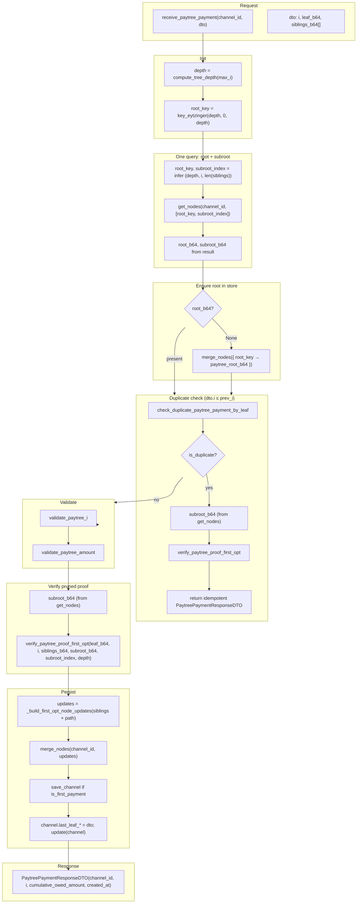

# PayTree first-opt vendor: receive-payment data flow

Optimistic single-node fetch (aligned with `test_paytree_first_opt_walkthrough`).

## Storage reads (one round-trip)

| Step | What | Redis |
|------|------|--------|
| Root + subroot | Infer both keys, then one fetch | `MGET paytree_first_opt_node:{channel_id}:{root_key}` and `...:{subroot_index}` |

Infer and fetch are merged: compute `root_key` and `subroot_index`, then `get_nodes(channel_id, [root_key, subroot_index])` — one MGET, no `ZREVRANGE`, no second GET.

## Storage writes

| Step | What | Redis |
|------|------|--------|
| Root if missing | One key | `SET paytree_first_opt_node:...` + `ZADD` index |
| After verify | New nodes | `SET` per node + `ZADD` index (merge_nodes) |
| Channel metadata | Pruned channel | `SET payment_channel:{channel_id}` (save/update) |

## Dataflow summary

1. **In:** `channel_id`, `dto` (i, leaf_b64, siblings_b64).
2. **One read:** compute `root_key` and `subroot_index` (infer), then `get_nodes(channel_id, [root_key, subroot_index])` → root_b64, subroot_b64.
3. **Ensure root:** if root_b64 missing, `merge_nodes({ root_key })` once.
4. **Duplicate path:** if same (i, leaf), use subroot_b64 from step 2 → verify → return idempotent.
5. **Main path:** validate i and amount → use subroot_b64 from step 2 → verify.
6. **Write:** build updates (siblings + path), `merge_nodes`; optionally save channel; update channel last_leaf_*.
7. **Out:** `PaytreePaymentResponseDTO`.
